# **Abstract**

This project focuses on understanding how DNS servers operate by converting two Raspberry PIs into functional DNS servers. This is accomplished by utilizing Pi-Hole for its DNS, filtering, and logging capabilities paired with Unbound, a recursive, DNSSEC-validating resolver. The DNS servers run on an internal network, so clients had to be manually configured to use the Pi-Hole resolvers. Two Raspberry PIs are used with one as redundancy; A failover test was performed to test both resolvers. Forward and reverse internal resolution was observed after successfully configuring the PIs and connecting a client to the DNS server. Subsequent query logging was performed as the client used the DNS server. This project provided valuable newfound skills in configuration, troubleshooting, and reliability testing.

# **Introduction**

The main purpose of a DNS server is to translate human-readable domain names into IP addresses that computers can use. DNS, **Domain Name System**, functions like a directory service: when a client requests a domain such as `example.com`, DNS returns the corresponding IP address so the client can connect to the correct host.

In this project, Pi-hole serves as the LAN-facing DNS server for my devices. When a client queries a domain, Pi-hole first applies policy and performance checks: it determines whether the domain is allowed (for example, not present on a blocklist) and whether an answer is already available in its cache. If the domain is blocked, Pi-hole responds with a failure or sinkhole response; if the domain is cached, Pi-hole can return an answer immediately without contacting any upstream servers.

If Pi-hole does not have a cached answer for a domain, it forwards the request to an **upstream DNS resolver.** In a recursive configuration, the resolver obtains an answer by walking the DNS hierarchy—querying the **root**, **top-level domain (TLD)**, and **authoritative name servers**. These servers do not “validate legitimacy” in the sense of approving websites; instead, they provide delegation and authoritative data that allow the resolver to locate the correct server to answer the query.

The recursive process begins at the root level. There are thirteen logical root server identities which direct resolvers to the appropriate TLD name servers for the domain’s suffix (such as `.com`, `.org`, or country-code TLDs like `.uk`). The resolver then queries the relevant TLD server, which responds with a referral to the authoritative name servers responsible for specific domains such as `example.com`. Finally, the resolver queries the authoritative server to obtain the domain’s actual DNS records (such as A/AAAA records containing IP addresses).

After receiving the answer, the resolver returns the result to Pi-hole, and both the resolver and Pi-hole may cache the response for its **TTL (time-to-live)**. Caching reduces latency and avoids repeating the full recursive lookup process for subsequent queries.

Unbound runs on the Raspberry Pi as the recursive DNS resolver. Furthermore, Unbound communicates with root, TLD, and authoritative name servers to resolve queries and can also perform **DNSSEC validation**. Pi-hole forwards client queries to Unbound (typically on `localhost`), allowing Pi-hole to focus on LAN-facing policy and logging while Unbound handles recursive resolution.

# **Setup**

Two Raspberry PI 4 Model Bs are used in this project. One Raspberry PI serves as the main DNS server while the other serves as redundancy. Before installing Pi-hole and Unbound, the Raspberry PIs must have static IP addresses. I am running OS Lite on both Raspberry PIs because I do not have a monitor to directly access the Raspberry PIs. Instead, I enabled SSH and remotely configured the Raspberry PIs. SSH via public keys can be performed with two commands.

## **Setting Up SSH**

To generate an SSH key pair:  
`ssh-keygen -t ed25519 -a 64 -f $env:USERPROFILE\.ssh\id_ed25519 -C "windows-admin"`

* `ssh-keygen`  
  * Creates a public-private key pair based off asymmetric encryption  
  * Private key is kept on the Windows computer  
  * Public key is copied to the Raspberry Pi  
* `-t ed25519`  
  * Generates a key using the ed25519 algorithm, a modern secure and fast algorithm used in SSH protocols  
  * Known as the Edwards-curve Digital Signature Algorithm  
* `-a 64`  
  * Adds a passphrase to the private key so an attacker must know the passphrase to the key even after copying it  
  * 64 refers to the number of KDF (Key Derivation Functions) rounds where each round is a step in the derivation process and each step further increases the work needed to brute-force the private key  
* `-f $env:USERPROFILE\.ssh\id_ed25519`  
  * `$env:USERPROFILE`  
    * Windows home directory  
  * `.ssh\id_ed25519`  
    * A folder with the filename `id_ed25519`  
  * The files created:  
    * `C:\Users\YourName\.ssh\id_ed25519` → private key  
    * `C:\Users\YourName\.ssh\id_ed25519.pub` → public key  
* `-C "windows-admin"`  
  * Adds a comment to the public key

After generating a key pair, the public key must be copied to the Raspberry PI. This can be done with this command:

`Get-Content C:\Users\myUsername\.ssh\id_ed25519.pub | ssh piadmin@pi1 "mkdir -p ~/.ssh && chmod 700 ~/.ssh && cat >> ~/.ssh/authorized_keys && chmod 600 ~/.ssh/authorized_keys"`

* `Get-Content`  
  * Powershell command that reads from a file  
* `C:\Users\myUsername\.ssh\id_ed25519.pub`  
  * Reads the file containing the public key  
* |  
  * Redirects the output of one command into the next command  
* `ssh piadmin@pi1`  
  * Redirects the output of the `Get-Content` command, which read the public key, into the ssh command  
  * Uses the SSH protocol to remotely login into the Raspberry Pi through that username  
    * `piadmin` \= username on the Raspberry Pi  
    * `pi1` \= hostname on the Raspberry Pi  
* `"mkdir -p ~/.ssh && chmod 700 ~/.ssh && cat >> ~/.ssh/authorized_keys && chmod 600 ~/.ssh/authorized_keys"`  
  * After remoting accessing the Raspberry Pi, the Linux shell runs the quoted commands:  
    * `mkdir -p ~/.ssh`  
      * Create a .ssh folder or directory in the home directory  
      * `-p` \= do not error if it already exists; create parent directories if needed  
    * `&&`  
      * Only run the next command if the previous command succeeded  
    * `chmod 700 ~/.ssh`  
      * Using octal values, allow only the owner of `.ssh` directory to have read, write, and execute access (111)  
    * `&& cat >> ~/.ssh/authorized_keys`  
      * `cat` \= reads from standard input  
        * Since the public key was piped from Windows, that is the standard input and is what cat reads  
      * `>> ~/.ssh/authorized_keys`  
        * Redirects the contents, the public key, read by the cat command into a file, `authorized_keys`, inside the `.ssh` directory  
        * `>>` \= append  
        * `>` \= overwrite  
        * This file contains a list of public keys  
    * `chmod 600 ~/.ssh/authorized_keys`  
      * Allows only the owner read and write access to the `authorized_keys` file (110)

## **Setting up static IPs**

Pi-hole requires static IPs to function, therefore it is important to set static IPs for the Raspberry PIs before installing Pi-hole. This can be done with `nmcli`, a command line tool used to communicate with the NetworkManager daemon. NetworkManager is a Linux service which manages network connections and keeps track of important information such as wireless networks, ethernet settings, IP addresses, gateways, and activity of the networks. 

`nmcli con show`

* Shows saved network connection profiles NetworkManager  
* Connection profile names can be in the format below:  
  * "`netplan-wlan0-Home-Network"`  
  * `"netplan-eth0"`

`sudo nmcli con mod "netplan-wlan0-Chen-Home-5G" ipv4.addresses 192.168.12.10/24`

* `sudo` \= run as administrator or root user  
* `nmcli` \= use NetworkManager CLI  
* `mod` \= modify  
* `"netplan-wlan0-Home-Network"` \= the saved connection profile you are editing  
* `ipv4.addresses` \= the IPv4 address field in that profile  
* `192.168.12.10/24` \= assign this static IP and subnet  
  * `/24` refers to the subnet mask: `255.255.255.0`  
  * network: `192.168.12.0`  
  * usable hosts: roughly `192.168.12.1` to `192.168.12.254`

`sudo nmcli con mod "netplan-wlan0-Home-Network" ipv4.gateway 192.168.12.1`

* Only send network traffic to the Raspberry Pi, otherwise send it to the gateway 192.168.12.1

`sudo nmcli con mod "netplan-wlan0-Home-Network" ipv4.dns "192.168.12.1"`

* Uses the IP address `192.168.12.1` as the DNS server

`sudo nmcli con mod "netplan-wlan0-Home-Network" ipv4.method manual`

* Tells the NetworkManager to not use DHCP for IP configurations for this network profile  
* Instead use the address, gateway, and DNs values that were manually entered

`sudo nmcli con mod "netplan-wlan0-Home-Network" connection.autoconnect yes`

* Bring connection up after boot automatically

`sudo nmcli con up "netplan-wlan0-Home-Network"`

* Applies the changes made to the network profile immediately

The other Raspberry Pi follows the same configuration steps, but uses the static IP address 192.168.12.11 instead of 192.168.12.10.

## **Setting Up Ethernet**

In addition to setting up static IPs for both Raspberry PIs, I also configured backup ethernet access as a fallback if Wi-Fi breaks on either Pi.

`sudo nmcli con mod "netplan-eth0" ipv4.addresses 192.168.99.3/24`  
`sudo nmcli con mod "netplan-eth0" ipv4.method manual`  
`sudo nmcli con mod "netplan-eth0" connection.autoconnect yes`

* Set Ethernet static IP to `192.168.99.3` and `192.168.99.4` for each respective Raspberry Pi  
* use manual addressing, not DHCP  
* bring it up automatically when possible

## **Verification**

To test whether the static connections have been set and are functional, two commands are used: ip and ping.

* `ip`  
  * Low-level Linux command used to show or manipulate routing, devices, policy routing, and tunnels  
* `ping`  
  * A Linux command used to send ICMP (Internet Control Message Protocol) echo requests to various destination hosts for troubleshooting purposes  
* `ip r`  
  * Displays the routing table that the Raspberry Pi currently has configured  
* `ip -br a`  
  * Displays existing network interfaces with respective IP addresses  
* `ping -c 2 192.168.12.1`  
  * Sends two ICMP echo requests to the gateway address (usually the router)  
  * `-c 2`  
    * Denotes the number of ICMP echo requests sent (denoted by the integer after the option)  
  * If the ping succeeds (with zero dropped packets), then:   
    * the Pi has a working local IP  
    * the subnet is correct  
    * the router is reachable  
    * the interface is functioning  
* `ping -c 2 1.1.1.1`  
  * Sends two ICMP echo requests to an internet IP  
    * If the packets are successfully delivered, then the local network gateway, and internet routing works

**Output of ip r:**  
`default via 192.168.12.1 dev wlan0 proto static metric 600`  
`192.168.12.0/24 dev wlan0 proto kernel scope link src 192.168.12.10 metric 600`

* `default`  
  * route used for everything not otherwise matched  
* `via 192.168.12.1`  
  * send it to gateway `192.168.12.1`  
* `dev wlan0`   
  * use Wi-Fi interface  
* `proto static`   
  * this route was manually configured, not learned from DHCP  
* `metric 600`   
  * route priority value

**Output of ping \-c 2 192.168.12.1:**  
`PING 192.168.12.1 (192.168.12.1) 56(84) bytes of data.`  
`64 bytes from 192.168.12.1: icmp_seq=1 ttl=64 time=1.97 ms`  
`64 bytes from 192.168.12.1: icmp_seq=2 ttl=64 time=1.60 ms`

`--- 192.168.12.1 ping statistics ---`  
`2 packets transmitted, 2 received, 0% packet loss, time 1002ms`  
`rtt min/avg/max/mdev = 1.601/1.783/1.965/0.182 ms`

* Shows two ICMP packets being sent and successfully received by the destination host

# **Installing Pi-Hole**

Once both Raspberry PIs are successfully configured with static IPs, it is time to install Pi-hole.

To install Pi-hole, the follow command can be used:

* `curl -sSL https://install.pi-hole.net | bash`  
  * `curl`  
    * A command used to transfer data to and from a server and is possible through a wide range of network protocols  
    * These network protocols include HTTP, HTTPS, FTP, and others  
  * `-s`  
    * Hides progress meter and most output noise  
  * `-S`  
    * Will display error messages  
    * When used in conjunction with `-s`, it will not display any status updates unless something goes wrong  
  * `-L`  
    * Follows any serve redirects  
  * `https://install.pi-hole.net`  
    * The url containing the installation script for Pi-hole  
  * `|`   
    * Transfers the output of the curl command, the script pulled from the URL, and sends it into the bash shell  
  * `bash`  
    * Bourne Again SHell  
    * Bash reads the installation script and executes it

When installing Pi-hole, an installation wizard will appear on the terminal screen. The first statement from the wizard is that the installer will transform the device into a network-wide ad blocker:

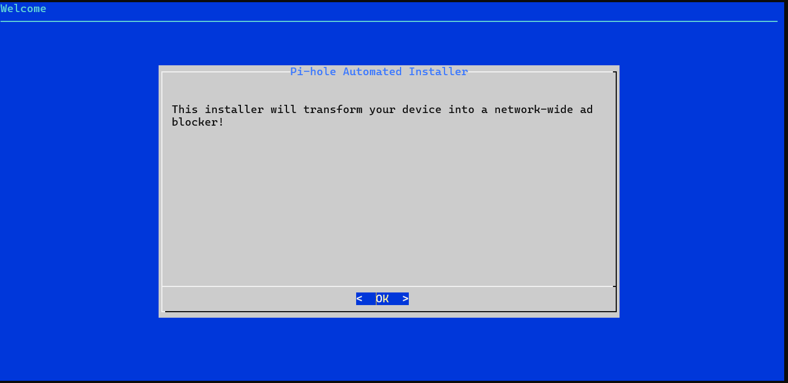

Furthermore, the Pi-hole installation process will warn the user that a static IP address is needed and will allow the user to exit installation to fix this issue if needed:

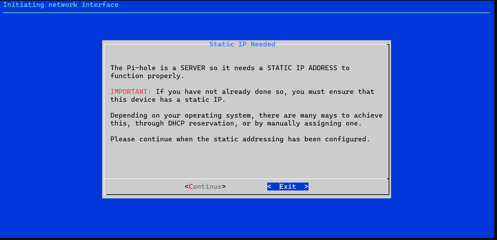

Next, Pi-hole will ask for the interface that the Pi-hole will run through. I selected wlan0 or the wireless interface because I am not using Pi-hole through the physical ethernet connection (eth0). For me, it is more convenient to connect the device wirelessly to the DNS server.  
   
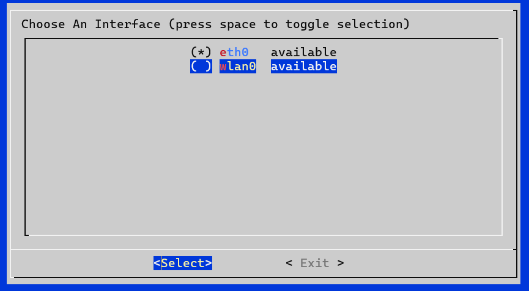

Pi-hole will inquire the user if they would like to use a third-party list to block ads. This third part list in particular is StevenBlack’s Unified Hosts List, a community maintained list of blocked domains. If a device on the network tries to resolve to one of those domains, then Pi-hole stop the DNS lookup. If you are interested in setting a default list of domains to be blocked, then select ‘Yes’ on the installation wizard.  

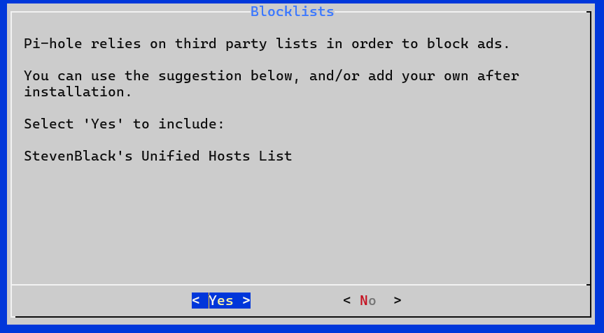 

When asked to enable query logging, select “Yes” because this allows us to record the DNS queries made by clients on the network. This is useful for troubleshooting DNS resolution and filtering behavior.   

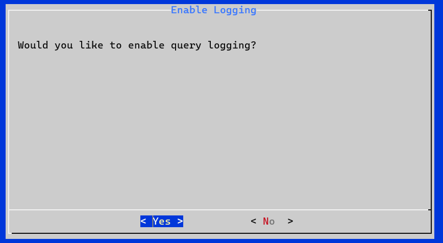

This window asks the user for the level of privacy for users on the FTL (Faster Than Light) DNS server. FTL handles DNS, statistics, and query logs. I selected “Show everything” so that I can fully observe DNS queries that occur through the Pi-hole server.  

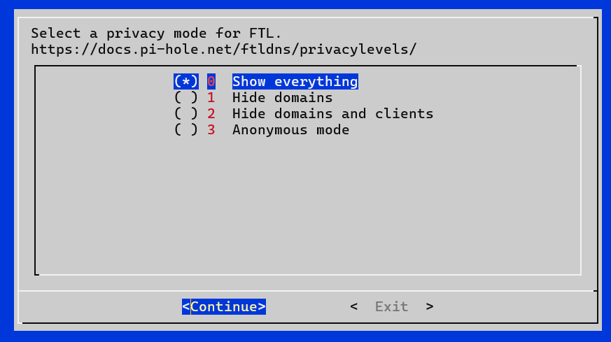

When going through the installation setup wizard, there is a page that asks for the Upstream DNS provider. You can select any DNS provider because we will be replacing that DNS provider with Unbound.

Once all the configurations have been made, the window will display “Installation Complete\!” with further instructions to access the web interface at the posted link. An Admin Webpage login password is provided, but this password can be changed using the command:

`sudo pihole setpassword`

# **Adding Local DNS Records**

Before testing the Pi-hole DNS capabilities, I first accessed the web interface to add local DNS records. This can be done by typing in `http://<Static IP>/admin` where `<Static IP>` is the static IP of the Raspberry Pi with Pi-hole installed. Enter the password that was sent in the Raspberry Pi terminal to access the main dashboard.

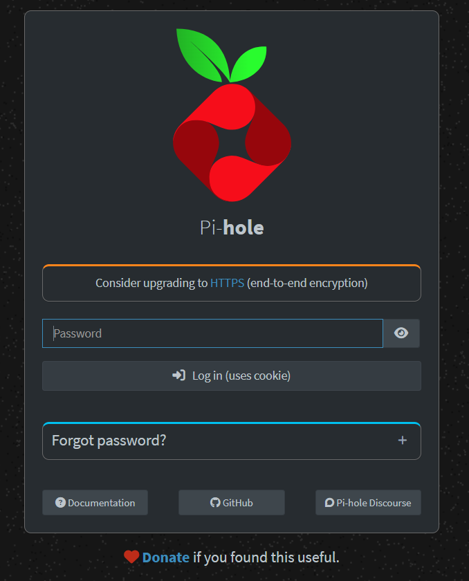
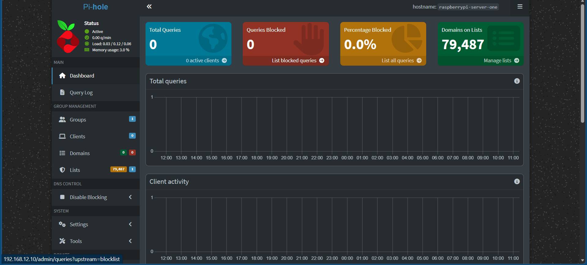

To locate, head to Settings → Local DNS records where we can find the list of local DNS records:  

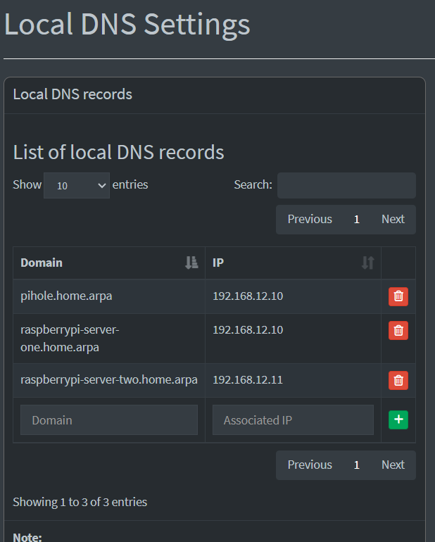

Here, we can enter the domain name and its corresponding IP address. Local DNS records are names created for devices within the local network. These records do not exist on the wider internet and usually point to private IP addresses such as `192.168.x.x`. The domain, `home.arpa`, is a special domain reserved for home networks and helps avoid conflicts with real public domains. In this screenshot, I have set domain names for both Raspberry Pi DNS servers.

# **Adding Reverse Local DNS Records**

In addition to adding Local DNS Records, it is important to add the reverse of those records. This means that instead of a domain mapping to an IP address, it is an IP address that maps to a domain. The reverse lookup is called a **PTR record**. Reverse records are useful because some tools and logs try to turn IP addresses back into hostnames. These include:

* `nslookup 192.168.12.10`  
* `dig -x 192.168.12.10`  
* network logs  
* SSH logs  
* admin tools that display hostnames instead of raw IPs

Without reverse records, the IP still works, but you may just see the raw address instead of a hostname.

Reverse records can be added manually using this command in the Raspberry Pi shell terminal:

`sudo tee /etc/dnsmasq.d/05-ptr-records.conf >/dev/null <<'EOF'`  
`ptr-record=10.12.168.192.in-addr.arpa,pi1.home.arpa`  
`ptr-record=11.12.168.192.in-addr.arpa,pi2.home.arpa`  
`EOF`

* Creates a **dnsmasq** file that contains two **PTR records** that are added before ‘EOF’ is entered  
* `tee /etc/dnsmasq.d/05-ptr-records.conf`  
  * Reads from standard input and writes to standard output and files  
* `>/dev/null`  
  * Redirects the standard output from tee to the /dev/null, a file that deletes anything written to it  
* `<<'EOF'`  
  * Start a here-document. Everything until the ending `EOF` is sent as input to `tee`.  
* So anything proceeding the first line is written into the file unless that line is EOF, where the document ends  
* `ptr-record=10.12.168.192.in-addr.arpa,pi1.home.arpa`  
  * A PTR record that begins with the IP address, then the corresponding domain  
  * Reverse DNS for IPv4 uses the special domain in-addr.arpa and the IP octets are written backwards  
    * IP: `192.168.12.10`  
    * reverse form: `10.12.168.192.in-addr.arpa`  
* Note: the IP and domain names must match the local DNS records.

## **Verification**

Once the PTR and local DNS records are set up, it is time to test the Pi-hole server and DNS records. On Windows, it can be done with the command:

`nslookup pi-hole.net 192.168.12.10`

* `nslookup`  
  * A command used to diagnose DNS infrastructure  
* `pi-hole.net`  
  * Domain name being looked up  
* `192.168.12.10`   
  * the specific DNS server you want to ask  
* Performs a DNS query for the domain, `pi-hole.net`, using the specific DNS server at 192.168.12.10

**Output:**  
`Server: pi.hole`  
`Address: 192.168.12.10`

`Non-authoritative answer:`  
`Name: pi-hole.net`  
`Address: 162.244.93.14`

* `Server: pi.hole`  
  * DNS server that answered question, here it is the Pi-hole server at 192.168.12.10  
* `Address: 192.168.12.10`  
  * IP address of the DNS server queried  
* `Non-authoritative answer:`  
  * Pi-hole is giving a result learned through resolving or forwarding the query, not because it is the official owner of pi-hole.net  
* `Name: pi-hole.net`  
* `Address: 162.244.93.14`  
  * This is the resolved IP address for the public domain `pi-hole.net`.  
* **Validates:**  
* Windows laptop can reach the DNS server at `192.168.12.10`  
* Pi-hole is running and listening for DNS queries  
* Pi-hole can resolve external/public internet domains  
* upstream DNS resolution is working

`nslookup raspberrypi-server-one.home.arpa 192.168.12.10`

* Performs a DNS query using the Pi-hole server that looks up the local domain `raspberrypi-server-one.home.arpa` 

**Output:**  
`Server:  pi.hole`  
`Address:  192.168.12.10`

`Name:    raspberrypi-server-one.home.arpa`  
`Address:  192.168.12.10`

* Output should show the Pi-hole server on the Raspberry Pi is performing DNS resolutions  
* It should also show that local domain, which corresponds to the Raspberry Pi server, exists, meaning the local DNS record is functioning properly  
* There is no “Non-authoritative answer” because Pi-hole is likely answering directly from its own DNS configuration  
* This should also be used to test the other local DNS records

In Linux, the dig command can be used to perform DNS lookups and troubleshoot DNS name servers. Here are two examples shows DNS and reverse DNS lookup:  
`dig @192.168.12.10 pi2.home.arpa +short`  
**Output:**  
`192.168.12.10`

* `dig`   
  * DNS lookup tool   
* `@192.168.12.10`  
  * ask the DNS server at `192.168.12.10`  
* `pi2.home.arpa`  
  * the hostname to look up  
* `+short`  
  * Shows a shortened version of a typical ‘dig’ output

`dig @192.168.12.10 -x 192.168.12.11 +short`  
**Output:**  
`raspberrypi-server-two.home.arpa.`

* `-x 192.168.12.11`   
  * do a reverse DNS lookup  
* `+short`  
  * print only the short result

# **Installing Unbound**

Now, we can move onto installing Unbound. Unbound can be installed with this command:

`sudo apt install -y unbound`

* `apt`  
  * Advanced Package Tool  
    * Used to install, remove, and update software on Debian-based Linux distributions  
* `install -y unbound`  
  * Installs the Unbound and select “Yes” to any confirmation prompts during the installation process 

Unbound is an open-source recursive DNS server and resolves the query by traversing the DNS hierarchy instead of asking an upstream DNS provider, such as Google or Cloudflare. The guide that I follow will have Pi-hole send upstream queries to `127.0.0.1#5335` or the Unbound recursive resolver. Unbound must also be configured before Pi-hole can connect and use it. This can be done through a configuration file:

`sudo nano /etc/unbound/unbound.conf.d/pi-hole.conf`

**While inside the nano text editor, add the following lines:**  
`server:`  
`verbosity: 0`  
`interface: 127.0.0.1`  
`port: 5335`  
`do-ip4: yes`  
`do-udp: yes`  
`do-tcp: yes`  
`do-ip6: yes`

`num-threads: 1`  
`so-rcvbuf: 1m`

`hide-identity: yes`  
`hide-version: yes`  
`qname-minimisation: yes`  
`prefetch: yes`

`# auto-trust-anchor-file: "/var/lib/unbound/root.key"`

`# RFC1918 private addresses`  
`private-address: 192.168.0.0/16`  
`private-address: 169.254.0.0/16`  
`private-address: 172.16.0.0/12`  
`private-address: 10.0.0.0/8`  
`private-address: fd00::/8`  
`private-address: fe80::/10`

`# RFC6303 - block reverse lookups for non-public ranges`  
`private-address: 192.0.2.0/24`  
`private-address: 198.51.100.0/24`  
`private-address: 203.0.113.0/24`  
`private-address: 255.255.255.255/32`  
`private-address: 2001:db8::/32`

* The configuration format in Unbound is attribute: value  
* `server:`   
  * Beginning of clause containing all settings that apply to Unbound’s DNS server behavior  
* `verbosity: 0`  
  * Refers to logging level  
  * **0 means “show only errors”**; higher numbers correspond with more detailed logs  
* `interface: 127.0.0.1`  
  `Port: 5335`  
  * Unbound will only listen on localhost, `127.0.0.1`, and use port 5335 instead of the normal DNS port 53  
  * Pi-hole will server clients on port 53, so Unbound cannot use that port  
* `do-ip4: yes`   
  * answer/send DNS over IPv4  
* `do-ip6: yes`   
  * answer/send DNS over IPv6  
* `do-udp: yes`   
  * allow UDP DNS  
* `do-tcp: yes`   
  * allow TCP DNS  
* `num-threads: 1`  
  * Use one worker thread; No threading  
* `so-rcvbuf: 1m`  
  * Ask the operating system for 1 MB receive buffer on the socket so short bursts of DNS traffic are less likely to drop packets  
* `hide-identity: yes`  
  * **refuse special queries** such as `id.server` and `hostname.bind`  
    * These queries identify who the server is  
* `hide-version: yes`  
  * Refuses `version.server` and `version.bind` queries  
    * Identifies the version of the Unbound server  
* `qname-minimisation: yes`  
  * Privacy feature. Unbound sends the **minimum necessary part of the domain name** to upstream authoritative servers while resolving. That reduces how much each server in the chain learns about the full name you asked for.  
* `prefetch: yes`  
  * Cache optimization  
  * Unbound refreshes cached entries that are close to expiring on a cache hit.   
    * Slightly increases query traffic, but keeps popular records fresh and can make repeated lookups feel faster  
* `auto-trust-anchor-file: "/var/lib/unbound/root.key"`  
  * Used for DNSSEC validation  
    * DNSSEC is a security protocol that adds cryptographic signatures to DNS records in order to verify the DNS response is authentic  
    * By checking for signatures, it ensures “man-in-the-middle” attacks are avoided  
  * `trust-anchor`  
    * Known and validated public key used as the starting point for DNSSEC validation  
    * The “auto” portion means Unbound will main and update it automatically  
  * `/var/lib/unbound/root.key`  
    * The location of the file containing the key  
  * Does not need to be included as Unbound includes the DNSSEC trust anchor and support when installed  
* `# RFC1918 private addresses`  
  `private-address: 192.168.0.0/16 	# IPv4`  
  `private-address: 169.254.0.0/16 	# IPv4 link-local`  
  `private-address: 172.16.0.0/12	# IPv4`  
  `private-address: 10.0.0.0/8		# IPv4`  
  `private-address: fd00::/8		# IPv6 unique local`  
  `private-address: fe80::/10		# IPv6 link-local`  
  * Describes the range of IP addresses that are private or only allowed on the local network  
  * Done so internet domain names cannot return these addresses, which can cause DNS rebinding attacks  
  * helps stop public website domain names from attempting to trick clients into talking to devices on the LAN as if they were internet hosts. 

The above configuration follows some of the specifications outlined by the Pi-hole DNS guide for Unbound, found here: [unbound \- Pi-hole documentation](https://docs.pi-hole.net/guides/dns/unbound/).

After the configuration file is set, it is time to enable these changes and run Unbound.  
First, we must allow Unbound to start up on boot and to start it in the current Raspberry Pi session. This can be done with the command:

`sudo systemctl enable --now unbound`

* `sudo`  
  * Run as administrator  
* `systemctl`   
  * Tool used to manage systemd services  
* `enable`  
  * Unbound immediately starts on boot  
* `--now`  
  * Start action immediately right now

To apply the changes made in the configuration file, the Unbound service must be restarted:

`sudo systemctl restart unbound`

To check the status of Unbound and to ensure no errors occurred:

`sudo systemctl status unbound --no-pager`

* `status`  
  * Shows information about the service including if it’s running, recent logs from `journald`, process ID, and if it is enabled  
* `--no-pager`  
  * tells `systemctl` to print the output directly to the terminal instead of opening it in a pager program like `less`

## **Verification**

To ensure Unbound is working properly, we will rely on several commands that will verify that Unbound is listening and operating on the correct port. The `dig` command is particularly useful for its ability to perform DNS lookups on specific ports and addresses:

`dig @127.0.0.1 -p 5335 dnssec-failed.org +short`

* `dig`  
  * DNS lookup tool  
* `@127.0.0.1`  
  * The localhost IP that Unbound listens on  
* `-p 5335`  
  * Uses port 5335  
  * Unbound uses port 5335 while Pi-hole uses the port 53  
* `dnssec-failed.org`  
  * A special domain used for DNSSEC validation testing  
  * Domain is intentionally broken, so resolvers such as Unbound should **NOT** return an IP address  
* `+short`   
  * print only the short answer, if there is one.

`dig @127.0.0.1 -p 5335 example.com +short`

* Follows a similar example as above, but instead queries [example.com](http://example.com)  
* Used to validate that Unbound can resolve normal domains

**Output:**  
`104.18.26.120`  
`104.18.27.120`

* Output of the previous `dig` command shows Unbound can successfully resolve normal domain names and return valid A records (IPv4 addresses)

In addition, we can use the `ss` command to view all listening sockets similar to netstat:

`sudo ss -lntup | grep ':53'`

* `sudo`  
  * Requires administrative privileges  
* `ss`  
  * Socket statistics; used to view listening network ports and connections  
* `-l`  
  * Display listening sockets only  
* `-n`  
  *  show numeric addresses/ports instead of trying to resolve names  
* `-t`  
  * Display TCP sockets  
* `-u`  
  * Display UDP sockets  
* `-p`  
  * Show process using socket  
* `| grep ':53'`  
  * Pipes the output of the ‘`ss`’ command into ‘`grep`’ which filters text based on patterns  
  * In this case, filter the output to lines containing `:53`

**The output should look something like this:**  
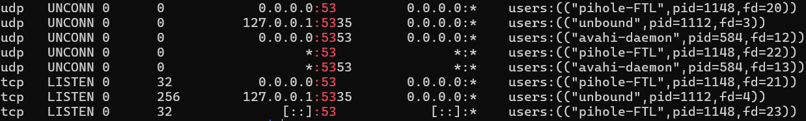

* The output should indicate that Pi-Hole FTL is listening on port 53  
  * `0.0.0.0:53` means it accepts DNS requests on all IPv4 interfaces  
  * `[::]:53` means it also listens on IPv6  
* The output should also indicate that Unbound is listening on 127.0.0.1:5335  
  * Only on localhost, meaning it is not exposed to the network

`sudo ss -lntup | grep ':53'`

* Similar to the previous command, but we are looking for port 5335 or localhost

**The output of this command should look like this:**  
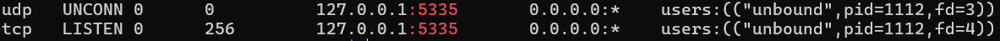

* the **Unbound process** owns port `5335` and is listening for both:  
  * **UDP** DNS traffic  
  * **TCP** DNS traffic  
* Again, notice how Unbound is only available locally

We can view the status of Unbound and note any issues using `journalctl`:

`sudo journalctl -fu unbound`

* `journalctl`   
  * view logs stored by `systemd-journald`  
* `-f`   
  * follow the logs live, like `tail -f`  
* `-u unbound`   
  * show only logs for the `unbound` service

# **Running Pi-hole with Unbound**

Inside the Pi-hole dashboard, accessible by typing `http://<Static IP>/admin` into the web browser, we will be able to connect Unbound to Pi-hole by heading from Settings → DNS.  
   
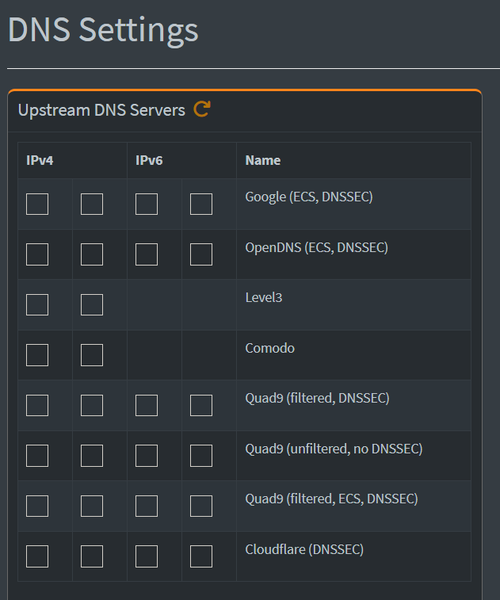

Here we will uncheck any upstream DNS server because we want to Unbound as our upstream DNS server.

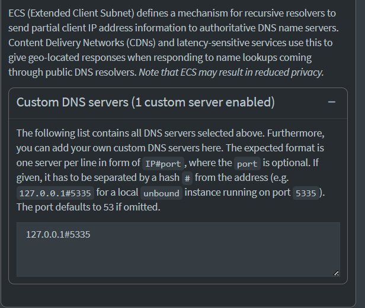

Below the list of provided upstream DNS servers is an entry box for custom DNS servers. Here, we will list the IP and port number of our Unbound DNS server in the format shown above. Once that is finished, we can test our DNS server setting a device’s DNS to our Pi-hole servers. 

For Windows 11 devices, we can head to Settings → Network & Wi-Fi → Wi-Fi → Hardware Properties and select “Edit” for DNS server assignment. There we set DNS settings to “Manual” and manually add the IP addresses that correspond to our Pi-hole servers.

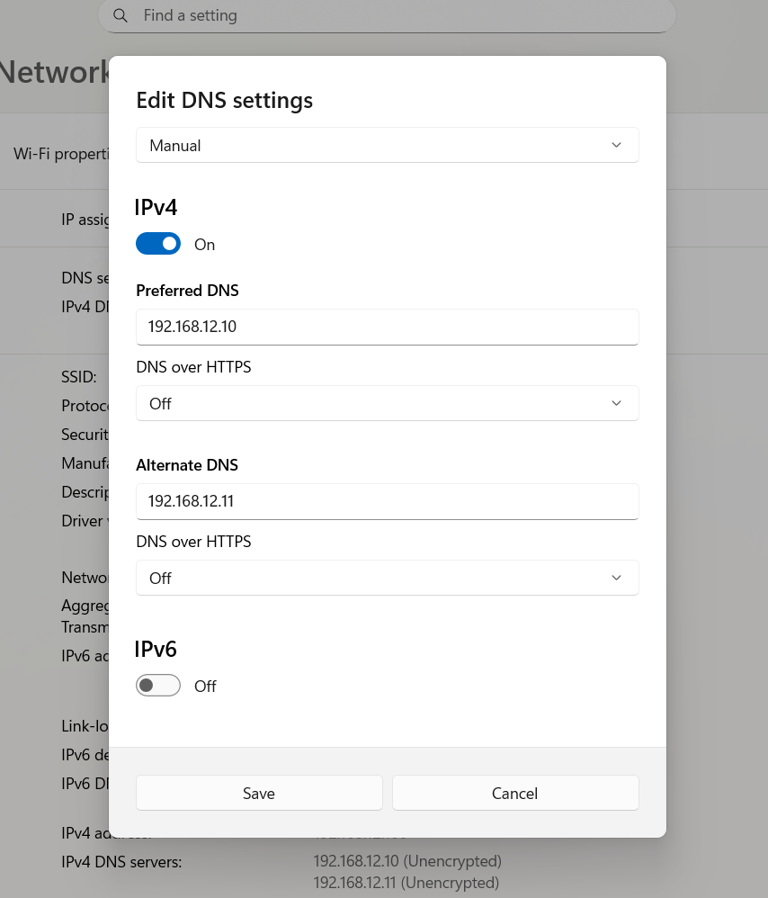

If Pi-hole is truly working and can resolves queries sent by clients, then using a command such as:

`nslookup google.com`

Will yield a corresponding IP address and the DNS server being Pi-hole.

Additionally, using commands such as:

`nslookup google.com 192.168.12.10`  
`nslookup google.com 192.168.12.11`

Will also work in testing the Pi-hole servers are resolving queries properly. For example:  
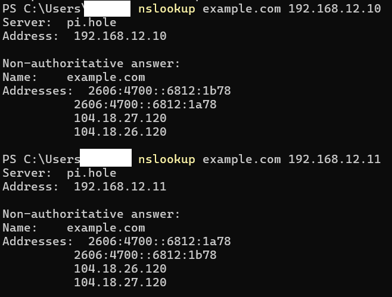

* Shows that both Pi-hole servers are properly communicating

## **Failover Test**

To ensure that the redundant Raspberry Pi DNS server is functioning, we will perform a failover test. In this test, the main Raspberry Pi DNS server is stopped and we observe if the second DNS server will continue resolving queries.

To stop Pi-hole on the main Raspberry Pi, enter the terminal and run the command:

`sudo systemctl stop pihole-FTL`

* `stop`  
  * This option stops services such as pihole-FTL. 

Once the service is stopped we can run “nslookup example.com” from our device terminal to see if the redundant Pi-hole service is running. After validating, we can start the service again with:

`sudo systemctl start pihole-FTL`

# 

# **Results**

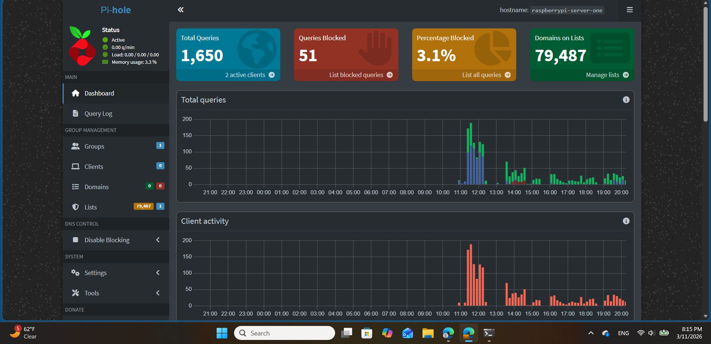
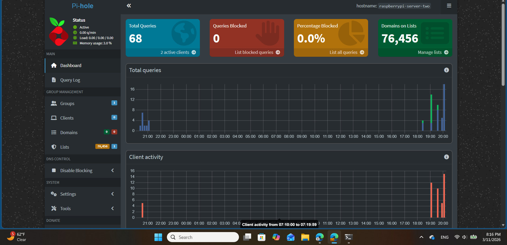

The Pi-hole dashboards above confirm that both DNS servers are active and handling live client traffic. It shows the total number of DNS queries received, how many were blocked by the configured blocklists, and the percentage of filtered requests. The graphs also demonstrate activity over time, which helped verify that clients on the network were successfully using the Raspberry Pi as their DNS resolver.

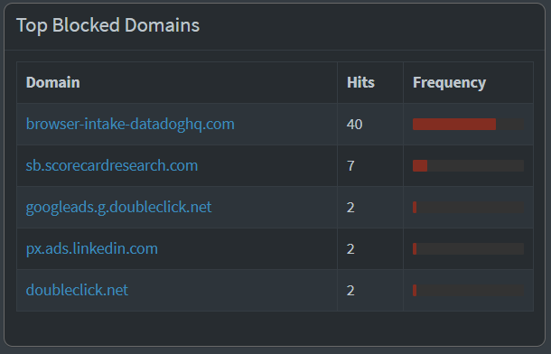

The “Top Blocked Domains” panel shows domains that were most frequently blocked by Pi-hole. Many of these were advertising, tracking, or analytics endpoints, demonstrating that the DNS sinkhole was successfully preventing unwanted third-party requests from resolving on the network.

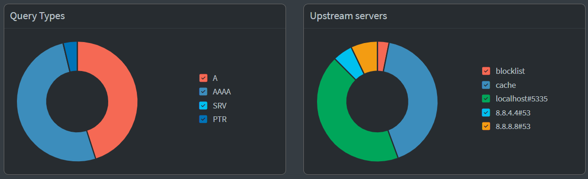

The query type chart above shows the mix of DNS record types handled by the server, including IPv4 host lookups (A), IPv6 lookups (AAAA), and reverse DNS queries (PTR). This helped confirm that the resolver was handling normal client DNS behavior across different request types. In the other pie chart, Upstream servers show that a majority of the queries were sent to Unbound (localhost\#5335) or was answered by a stored cache (no upstream required). The other upstream servers, 8.8.4.4\#53 and 8.8.8.8\#53, are Google’s DNS servers before switching to Unbound.

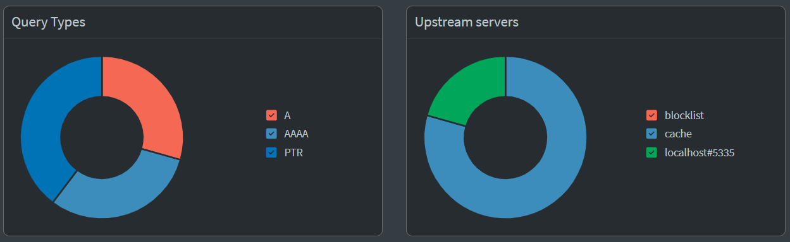

This chart showing query types and upstream servers is from the second, backup Raspberry Pi DNS server where Google was not used. Here, we can see that the only upstream server is Unbound and the rest are withered queries answered by Pi-hole’s cache or was a blocked domain.

# **Conclusion**

In this project, I successfully deployed a redundant internal DNS solution using two Raspberry Pi nodes with static IP addressing to ensure consistent reachability and predictable network behavior. Assigning fixed addresses to each Raspberry Pi established a stable foundation for hosting infrastructure services and prevented DNS outages caused by changing DHCP leases. With stable networking in place, I installed and configured Pi-hole as the LAN-facing DNS server, enabling centralized name resolution for my clients along with filtering via blocklists and visibility through query logging. I then paired Pi-hole with Unbound as the upstream resolver, configuring Pi-hole to forward requests to Unbound on localhost so Unbound could perform recursive resolution and return validated responses back to Pi-hole.

Beyond completing the configuration, the project helped me understand key DNS concepts in a practical way. I learned the difference between internal name resolution and public DNS resolution, how forward lookups map hostnames to IP addresses, and how caching and TTL behavior can affect troubleshooting. Implementing Unbound reinforced how recursive DNS works by walking the DNS hierarchy (root, TLD, and authoritative name servers), and it clarified how a resolver differs from a LAN-facing DNS service like Pi-hole. Most importantly, setting up two resolvers and verifying that name resolution continued when one Pi was taken offline demonstrated the operational value of redundancy and basic high-availability planning.

Troubleshooting was a major part of the learning process and closely resembled real system administration work. I diagnosed issues such as DNS failures caused by incorrect upstream configuration and resolver errors, validated service health using `systemctl` and logs via `journalctl`, and confirmed behavior with targeted queries using tools like `nslookup` and `dig`. Resolving these issues required isolating components (client, Pi-hole, Unbound, upstream resolution) and testing each layer independently until the failure point was identified and corrected.

Finally, I used Pi-hole’s dashboard and query log as a lightweight monitoring and reporting tool. The interface provided immediate insight into total query volume, cache behavior, client activity, and the domains being blocked by the configured lists. Reviewing allowed vs blocked queries helped confirm that filtering was working as intended and gave practical experience interpreting DNS logs as an operational signal. Overall, this project demonstrated how DNS can be deployed and managed as a reliable network service, and it provided hands-on experience with infrastructure planning, service configuration, troubleshooting methodology, and basic monitoring practices.
